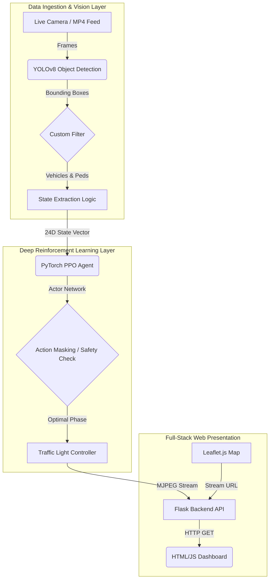

# System Architecture & Development Log

This document outlines the architectural decisions, data flow, and development progression of the Pedestrian-Aware Deep Reinforcement Learning project. It serves as a technical reference for the system's design and a log of the engineering challenges overcome during implementation.

## 1. High-Level System Architecture

The system is composed of three primary layers: Data Ingestion (Computer Vision), Decision Logic (Deep Reinforcement Learning), and Presentation (Web Dashboard).

## 2. Core Components

### A. The Computer Vision Pipeline (`real_world_inference.py`)
To map raw video to a Reinforcement Learning state, I utilized YOLOv8. The raw output of YOLOv8 contains 80+ COCO classes. I implemented a strict filtering algorithm to only track `car`, `truck`, `bus`, and `person`. 
*   **Bounding Box to Queue Conversion:** The primary engineering challenge here was mathematically converting 2D bounding boxes into actionable queue lengths. I divided the camera frame into geometric "lane zones" and counted objects resting within those polygons to construct the PPO State Vector.

### B. The PPO Agent (`ppo_agent.py`)
The Deep Reinforcement Learning model is based on Proximal Policy Optimization (PPO). 
*   **State Space:** The agent receives a `24D` vector representing vehicle queues, pedestrian waits, and current phase durations.
*   **Action Space:** A discrete set of phases (e.g., North-South Green, East-West Green, All-Red Pedestrian Phase).
*   **Reward Shaping:** The most difficult aspect of the PPO design was the reward function. Initially, the agent suffered from "Pedestrian Drowning"—it would ignore pedestrians because delaying 50 cars incurred a heavier mathematical penalty than delaying 2 pedestrians. I resolved this by injecting a massive, non-linear penalty for violating crosswalk safety constraints.

### C. The Web Streaming Bridge (`server.py`)
To present the inference in real-time, I built a Flask application. 
*   **Frame Skipping:** Running YOLOv8 on every frame of a 60fps video caused severe bottlenecking. I optimized the pipeline by running inference only every $n^{th}$ frame while propagating the previous bounding boxes, allowing the Flask server to yield a smooth `multipart/x-mixed-replace` MJPEG stream natively to the browser.

## 3. Development Phases & Iteration Log

### Phase 1: Environment Simulation (MDP)
Development began entirely in simulation (`intersection_env.py`). Before any computer vision could be added, the mathematical Markov Decision Process (MDP) had to be verified. I built a JavaScript canvas visualization to debug the agent's behavior and ensure the queue mathematics were correct.

### Phase 2: Curriculum Learning Implementation
Training the Actor-Critic network proved unstable when initialized on heavy traffic distributions. I implemented a Curriculum Learning strategy, forcing the agent to master low-density traffic for the first 500 episodes before introducing heavy rush-hour conditions. This significantly stabilized the loss function.

### Phase 3: YOLOv8 and "Sim-to-Real" Transfer
Once the PyTorch weights (`drl_pa.pt`) were frozen, I built the CV pipeline to act as the "eyes" of the agent. This proved that the agent, trained in a sterile numerical simulation, could successfully transfer to noisy, real-world visual artifacts.

### Phase 4: API and Global Integration
To prove the hardware agnosticism of the architecture, I integrated `yt-dlp` into the backend. This allowed the system to bypass local MP4 files and directly ingest HLS (`.m3u8`) streams from public traffic cameras globally, proving the system can operate on any standard IP camera feed without proprietary hardware.
