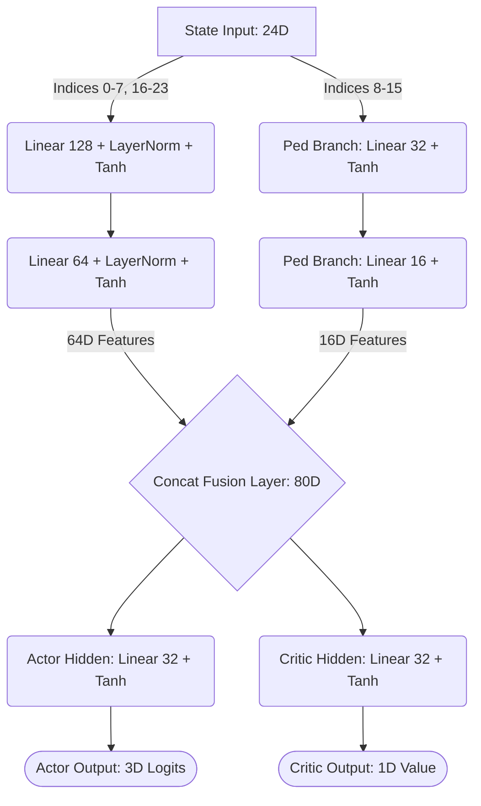

# Deep Reinforcement Learning Model Specifications

This document outlines the strict mathematical and structural specifications of the Proximal Policy Optimization (PPO) agent used in the Pedestrian-Aware Traffic Signal Control project. 

It is designed to serve as an academic reference for the underlying Deep Neural Network.

---

## 1. State and Action Spaces

### 1.1 State Vector Definition ($S_t$)
The environment returns a **24-Dimensional continuous state vector** representing the intersection at time step $t$.

| Index | Feature Description | Type |
| :--- | :--- | :--- |
| `0-3` | Vehicle queue lengths (North, South, East, West) | Integer |
| `4-7` | Cumulative waiting times for vehicles in respective queues | Float |
| `8-15` | **Pedestrian metrics (Counts and Waiting times at crosswalks)** | Integer / Float |
| `16-19` | Emergency vehicle presence indicator (Placeholder for Future Expansion) | Boolean |
| `20-23` | Current phase one-hot encoding & elapsed phase duration | Boolean / Float |

### 1.2 Action Space Definition ($A_t$)
The Agent selects from a discrete action space consisting of 3 possible traffic light phases.

| Action Index | Phase Name | Description |
| :---: | :--- | :--- |
| `0` | **NS_GREEN** | Green light for North-South vehicle traffic. |
| `1` | **EW_GREEN** | Green light for East-West vehicle traffic. |
| `2` | **PED_CROSSING** | All-Red for vehicles; Green for pedestrians. *(Action is masked out with $P(a) = 0$ if no pedestrians are waiting to cross).* |

---

## 2. Neural Network Architecture

The model utilizes a custom **Actor-Critic architecture with bifurcated feature extraction**. Because the vehicle magnitudes (e.g., 50 cars) heavily outweigh the pedestrian magnitudes (e.g., 2 people), the network uses a separate `ped_branch` to extract pedestrian features before fusing them with the main backbone.

### 2.1 Forward Pass Topology

### 2.2 Network Parameters

*   **Total Trainable Parameters:** 15,316
*   **Weight Initialization:** Orthogonal initialization ($\sqrt{2}$ gain for hidden layers, $0.01$ for Actor output to ensure low initial entropy, $1.0$ for Critic output).

---

## 3. Proximal Policy Optimization (PPO) Hyperparameters

The model is optimized using Generalized Advantage Estimation (GAE) and clipped policy gradients.

| Hyperparameter | Variable | Value | Description |
| :--- | :---: | :---: | :--- |
| **Learning Rate** | $\alpha$ | `3e-4` | Adam optimizer learning rate. |
| **Discount Factor** | $\gamma$ | `0.99` | Determines the importance of future rewards. |
| **GAE Lambda** | $\lambda$ | `0.95` | Controls variance/bias tradeoff in advantage estimation. |
| **Clipping Parameter** | $\epsilon$ | `0.2` | Trust region bound for policy updates. |
| **Epochs per Update** | $K$ | `6` | Number of times to train on the rollout buffer. |
| **Batch Size** | $B$ | `64` | Mini-batch size for stochastic gradient descent. |
| **Rollout Buffer Size** | $N$ | `256` | Steps collected before performing an optimization update. |
| **Entropy Coefficient** | $c_1$ | `0.05` | Encourages exploration to prevent premature convergence. |
| **Value Coefficient** | $c_2$ | `0.5` | Scales the critic MSE loss relative to the actor loss. |
| **Max Gradient Norm** | $L_2$ | `0.5` | Prevents exploding gradients during unstable training phases. |

---

## 4. Optimization Mathematics

### 4.1 Clipped Surrogate Objective Loss
The actor network is optimized using the standard PPO clipped objective to ensure monotonic improvement without catastrophic forgetting:

$$ L^{CLIP}(\theta) = \hat{\mathbb{E}}_t \left[ \min(r_t(\theta)\hat{A}_t, \text{clip}(r_t(\theta), 1-\epsilon, 1+\epsilon)\hat{A}_t) \right] $$

Where $r_t(\theta) = \frac{\pi_\theta(a_t|s_t)}{\pi_{\theta_{old}}(a_t|s_t)}$ is the probability ratio, and $\hat{A}_t$ is the generalized advantage estimate.

### 4.2 Total Loss Function
The total loss computed during the backward pass combines the policy loss, the value function error (Mean Squared Error), and the entropy bonus:

$$ L^{TOTAL} = -L^{CLIP} + c_2 L^{VF} - c_1 S[\pi_\theta](s_t) $$
